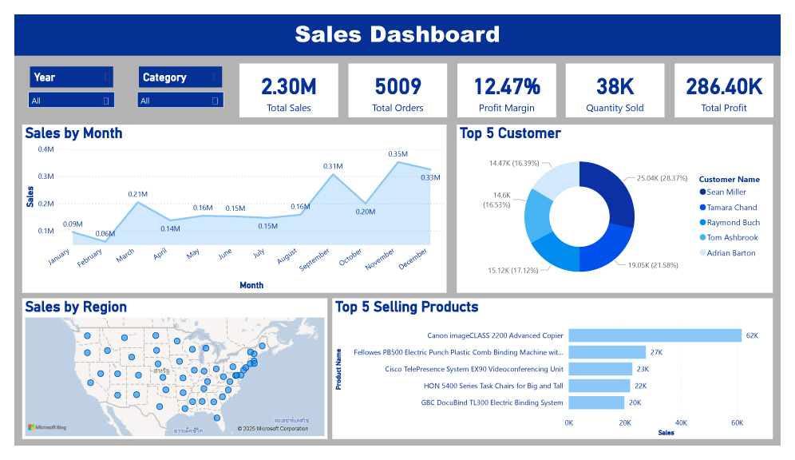

# 📊 Sales Performance Dashboard (Power BI)

An interactive dashboard built with **Power BI** to visualize sales performance, highlight key business insights, and support data-driven decisions.

---

## 🚀 Overview

This project transforms raw sales data into a clean and interactive dashboard. It answers essential business questions such as:

- 📈 What is the sales trend over time?
- 🛍️ Which products are top sellers?
- 🌍 Which regions drive the most revenue?
- 💰 What’s our profit margin?

Whether you're an analyst, manager, or decision-maker, this dashboard gives you the tools to explore your sales data effectively.

---

## 🔧 Features

- **KPI Cards**: Total Sales, Profit, Orders, Quantity
- **Trend Analysis**: Monthly sales and profit line charts
- **Regional Sales Map**: Visualize sales by geographic location
- **Top 5 Products**: Best-selling items by revenue
- **Dynamic Filters (Slicers)**: Date, Region, Category, Sub-category

---

## 📊 Tools & Skills Used

- **Power BI Desktop**
- **DAX** (e.g., `Total Sales`, `Profit Margin`, `Total Orders`)
- **Data Modeling** (Relationships, Calculated Measures)
- **Design Principles** (Layout, Color, User Interaction)

---

## 🧩 Dataset Details

- ~10,000 sales transactions
- Fields:
  - `Order Date`, `Sales`, `Profit`, `Quantity`
  - `Region`, `Customer ID`, `Category`, `Product Name`

> *Note: This dataset is a mockup version inspired by the Superstore dataset.*

---

## 📸 Screenshot

---

## 💬 Contact

If you're hiring or interested in a collaboration, feel free to reach out!

- 📧 [Email](mailto:thodsaphol.cha@gmail.com)
- 💼 [LinkedIn](https://www.linkedin.com/in/thodsaphon-chamnansuek-318642355)   
- 🌐 [myportfolio](https://github.com/ThodsaphonChamnansuek/my_portfolio.git)

---

> “Data is a tool, not an answer. But the right dashboard brings you closer to both.” 
> — Chat GPT 😉

